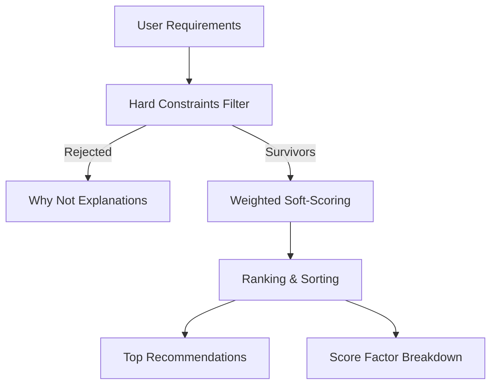
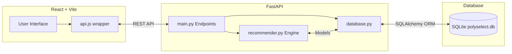

# PolySelect
**A decision-support expert system for polymer material selection.**

    

## Demo


## About
PolySelect is a material selection engine designed for PPE students, product designers, and small manufacturers. Instead of relying on guesswork, it filters polymers based on hard constraints like temperature or food safety, scores them against soft preferences, and ranks them logically. Every recommendation is fully explained so you know exactly why one material beat another.

## Features
- **Hard-Constraint Filtering**: Immediately rejects materials that fail non-negotiable physical constraints.
- **Weighted Scoring**: Evaluates surviving materials on 7 factors like Strength, Temperature, Cost, and Sustainability.
- **Detailed Explanations**: Generates a checklist of reasons for recommendations and explains why alternatives were rejected.
- **Comparison Tool**: Compares up to 3 materials side-by-side using radar charts and tables.
- **Cost Estimator**: Calculates raw material cost based on expected product weight and quantity.
- **Process Recommendation**: Suggests manufacturing methods (e.g., Injection Molding, Extrusion) based on the material and product shape.
- **What-If Simulator**: Diff tool to see how changes in requirements affect the material rankings.

## How It Works


The engine evaluates user inputs through two phases. First, it applies hard constraints (e.g., max operating temperature) to reject unsuitable choices. Then, it uses a weighted formula to score surviving materials out of 100 on traits like flexibility and cost, finally ranking them and producing automated explanations.

## System Architecture



## Tech Stack

| Layer | Technologies |
|---|---|
| **Frontend** | React 19, Vite 8, Tailwind CSS, React Router, Recharts, Framer Motion |
| **Backend** | Python, FastAPI, Uvicorn, Pydantic |
| **Database** | SQLite, SQLAlchemy ORM |

## Results & Accuracy

| Metric | Value |
|---|---|
| Accuracy | [ADD VALUE] |
| Precision | [ADD VALUE] |
| Recall | [ADD VALUE] |
| FPS | [ADD VALUE] |
| Dataset Size | 14 Polymers (Seed Data) |
| Test Setup | [ADD VALUE] |

## Screenshots

*Entering requirements in the primary material selection form.*


*Detailed ranking with the custom "spec ticket" material card and radar chart breakdown.*


*Comparing multiple materials side-by-side using the Compare tool.*

## Project Structure

```text
/
├── backend/            # FastAPI backend and SQLite database
│   ├── app/            # Application logic, models, schemas, recommender engine
│   └── requirements.txt# Backend Python dependencies
├── frontend/           # React frontend application
│   ├── public/         # Static assets
│   ├── src/            # React components, pages, context, and API wrapper
│   ├── package.json    # Frontend Node.js dependencies
│   └── tailwind.config.js # Tailwind styling rules
└── README.md           # This project overview
```

## Installation

### Prerequisites
- Python 3.9+
- Node.js 18+

### Commands (Windows PowerShell)

```powershell
# 1. Clone the repository and setup the backend
cd polyselect\backend
python -m venv venv
venv\Scripts\activate
pip install -r requirements.txt

# 2. Setup the frontend in a new terminal window
cd ..\frontend
npm install

# 3. Environment Variable Setup (Optional)
# The backend defaults to SQLite, but you can set DATABASE_URL in backend/.env for Postgres/MySQL.
# The frontend connects to http://localhost:8000 via VITE_API_URL in frontend/.env.
```

## Usage

### 1. Start the Backend API
```powershell
cd polyselect\backend
venv\Scripts\activate
uvicorn app.main:app --reload
```
*The API will be available at `http://localhost:8000`. API Docs: `http://localhost:8000/docs`.*

### 2. Start the Frontend
Open a new PowerShell window:
```powershell
cd polyselect\frontend
npm run dev
```
*The UI will be accessible at `http://localhost:5173`.*

## API Endpoints

| Method | Route | Auth | Purpose |
|---|---|---|---|
| GET | `/materials` | None | List all materials (summary) |
| GET | `/materials/{id}` | None | Get full detail profile for one material |
| POST | `/recommend` | None | Hard-filter, weighted-score, and rank materials |
| POST | `/compare` | None | Compare properties for selected materials |
| POST | `/cost` | None | Estimate cost for manufacturing part |
| POST | `/process` | None | Suggest manufacturing process and provide alternatives |
| POST | `/what-if` | None | Simulate before/after requirements and provide diff |

## Limitations and Future Work
- **Static Dataset**: Currently limited to 14 standard materials seeded at startup.
- **Cost Fluctuations**: The cost model uses static median price estimates rather than real-time API integrations.
- **Future Module**: An Admin CRUD panel for adding/editing new materials.
- **Future Module**: Student quizzes/evaluations tied to the decision engine.
- **Security Check**: CORS is currently set to `allow_origins=["*"]` which must be restricted ahead of production.

## Contributors, License, Contact
- **Contributors**: [ADD VALUE]
- **License**: [ADD VALUE]
- **Contact**: [ADD VALUE]
